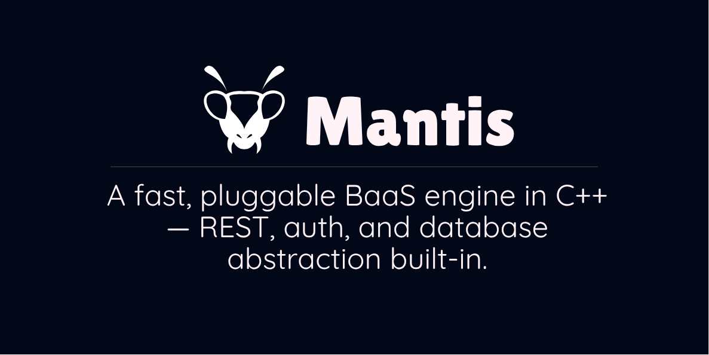

<p align="center">
  
</p>

<h1 align="center">Mantis</h1>

<p align="center">
  <strong>A lightweight, pluggable Backend-as-a-Service (BaaS) library built in C++</strong><br />
  Portable. Embeddable. Syncable. Built for speed and extensibility.
</p>


## 🔧 Overview

**Mantis** is a modular, lightweight C++ library designed to power modern backend systems in embedded devices, desktop tools, or standalone server deployments. Inspired by systems like PocketBase and Supabase, Mantis focuses on:

- Minimal runtime footprint
- SQLite as the default local database (with optional MySQL/PSQL support)
- Built-in authentication and access control: See [Auth Rules Docs](doc/03.rules.md)
- Auto-generated REST APIs from database Schema: See [API Basics Docs](doc/02.api.md)
- Embeddable as a reusable C++ library: See [Embedding Mantis Docs](doc/05.embedding.md)
- Lightweight bundled Admin Dashboard
- Single app binary for portability (~11MB, 3MB compressed)

> [!WARNING]  
> Mantis is still under active development and API might change as the project stablizes.

## 🛠️ Tech Stack

- **Language**: C++20
- **Compilers**: GCC
- **Database**: SQLite (default), PSQL (Linux), MySQL(planned)
- **Build System**: CMake
- **Packaging**: Docker + CLI
- **Sync**: WebSocket / REST delta sync (planned)

---

> NOTE: On windows, we use `mingw` not `MSVC` due to some feature incompatibility. For `mingw`, it requires at least `v13` with support for `std::format`.

---

## 🚀 Getting Started
There are three ways to get started with Mantis. 
1. Using pre-built binaries
2. Building from source
3. Embedding in another project
4. Running in a docker container

For any option taken, Mantis provides:
- An Admin dashboard exposed at `http://localhost:7070/admin`
- API endpoints exposed at `http://localhost:7070/api/v1/`

To access the admin dashboard, you will require to set up an admin user account. This is done via the commandline as detailed below:

#### Creating Admin Login account
To use the admin dashboard once we have started the server, we need to set up a new admin user account. From the embedded Admin dashboard interface, there is no provision for creating new user through the login panel, but admin users can be added later within the admin dashboard itself.

We can achieve this easily through the command-line tool for mantisapp.

```bash
mantisapp admins --add john@doe.com
```

You will be prompted to enter and confirm the password after which the user account can be used to sign into the admin dashboard.

### 1. Using pre-built binaries
Download pre-built binaries from our [release page](https://github.com/allankoechke/mantis/releases). First, download the zip package (~4mb) for the target platform and unzip it. With that, we can start the server as shown below;

```bash
./build/mantisapp serve -p 7070
```

### 2. Building from source
Why miss out on the fun? You can also clone the source setup your build environment and compile it all. Once compiled, the resultant binary can be executed just as the pre-compiled binary above.

```bash
git clone --recurse-submodules https://github.com/allankoechke/mantis.git
cd mantis
cmake -B build
cmake --build build
./build/mantisapp serve
```

By default, the app runs on port `7070`.

### 3. Embedding in another project
You can also embed Mantis as a library in your own C++ project:

- Add this project as a submodule to your project.
- Link your project to the library `mantis` target.
- Extend the project as shown below.

```cpp
#include <mantis/app/app.h>

int main(const int argc, char* argv[])
{
    mantis::MantisApp app(argc, argv);
    app.init();
    return app.run();
    
    // Or simply do ...
    // mantis::MantisApp app(argc, argv);
    // return app.initAndRun();
}
```
Check [/examples dir](/examples) for a working sample.

> Note: `MantisApp` has a blocking event loop when listening for http events. To avoid blocking your main thread if you intend to run something else there, move this into a separate thread.

### 4. Using Docker
You can also run `mantisapp` in a docker container. Check [using docker](doc/docker.md) docs for more information.  

---

> NB: Set `MANTIS_JWT_SECRET` environment variable to override the JWT secret used by Mantis. Remember that, the same key has to be always used to validate JWT tokens.  
> 
> `export MANTIS_JWT_SECRET=<your JWT secret>` # Linux  
> `set MANTIS_JWT_SECRET=<your JWT secret>`    # Windows

---

## Basic CMD Usage  

Mantis works with many cmd options, allowing us to configure and set different options that work best with our setup. This includes but not limited to:
- Selecting backend database: By default, SQLite is used but for Linux builds, you can also use PostgreSQL by providing the flags `--database PSQL --connection "dbname=<db> host=<host IP> port=<port> username=<db username> password=<db password>"`
- Switching base command options, that is, `serve` to start HTTP server, `admins` to set up admin accounts, `sync` WIP and `migrate` WIP.
- Providing debug info when running the server by setting the `--dev` mode flag.

```
mantisapp serve # Uses port 7070 by default
mantisapp --dev serve --port 5000 --host 127.0.0.1
mantisapp --dev admins --add admin@mantis.app # You will be prompted to enter password
mantisapp --database PSQL --connection "dbname=mantis host=127.0.0.1 port=5432 username=postgres password=postgres" serve
```

For more detailed CMD options, check out the [docs](doc/01.cmd.md) on this topic.

## 📁 Project Structure

```
mantis/
├── include/
│   └── mantis/         # Public API headers
├── src/                # Internal implementation
├── examples/           # Embedding examples
├── tests/              # Unit & integration tests
├── docker/             # Docker deployment
└── CMakeLists.txt
```

---

## 📚 Documentation

* [CLI Reference](doc/01.cmd.md)
* [API Reference](doc/02.api.md)
* [Architecture Overview](doc/04.architecture.md)
* [Embedding Guide](doc/05.embedding.md)
* [Sync Engine Design](doc/10.sync.md)

For full API Docs, check [https://docs.mantisapp.dev](https://allankoechke.github.io/mantis/).

---

##  Project Dependencies

* HTTP Server: [httplib-cpp](https://github.com/yhirose/cpp-httplib)
* Database Layer: [SOCI - SQL lib](https://github.com/SOCI/soci)
* Logging Layer: [spdlog](https://github.com/gabime/spdlog)
* Commandline Args: [Argparse](https://github.com/p-ranav/argparse)
* JWT: [l8w8tjwt](https://github.com/GlitchedPolygons/l8w8jwt)
* Password Hashing: [libbcrypt](https://github.com/rg3/libbcrypt)
* JSON: [nlohmann::json](https://github.com/nlohmann/json)
* Duktape/Dukglue: Ecmascript support for mantis scripting.

All these dependencies are included in the project as source files or as git submodules under [3rdParty/](./3rdParty/) or [libs](libs) directory.

---

## YouTube Video?
- [Mantis YouTube Playlist](https://youtube.com/playlist?list=PLsG0sKNmNpyQwsZuReuqo_nl_j4SdJoiJ&si=a9jFK4QjFJb06NAw)

## 🤝 Contributing

Contributions are welcome! Please see [CONTRIBUTING.md](CONTRIBUTING.md) and open an issue or PR.

---

## 📜 License

MIT License © 2025 Allan K. Koech

---

<p align="center"><i>Built with ❤️ using C++, SQLite, and a vision for portability.</i></p>

