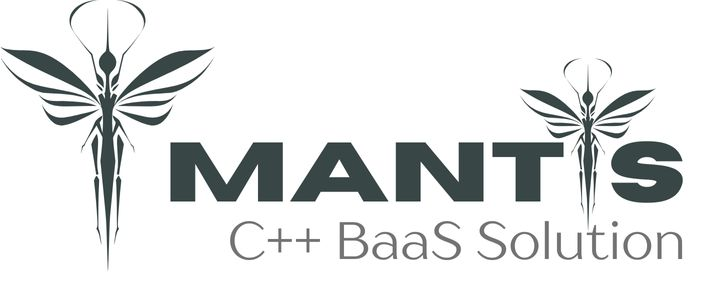

<p align="center">
  
</p>

<h1 align="center">Mantis</h1>

<p align="center">
  <strong>A lightweight, pluggable Backend-as-a-Service (BaaS) library built in C++</strong><br />
  Portable. Embeddable. Syncable. Built for speed and extensibility.
</p>


## 🔧 Overview

**Mantis** is a modular, lightweight C++ library designed to power modern backend systems in embedded devices, desktop tools, or standalone server deployments. Inspired by systems like PocketBase and Supabase, Mantis focuses on:

- Minimal runtime footprint
- SQLite as the default local database (with optional MySQL/PSQL support)
- Built-in authentication and access control
- Auto-generated REST APIs
- Pluggable sync layer (client-server)
- Embeddable as a reusable C++ library

---

## 📦 Features

| Feature                          | Status         |
|----------------------------------|----------------|
| ✅ Modular C++ core library       | ✅ Completed  |
| 🧩 Pluggable database interface   | 🟡 In Progress |
| 🔐 Authentication (JWT/session)  | ✅ Completed    |
| 📄 Auto API generation from schema | ✅ Completed    |
| 🧱 System metadata tables         | ✅ Completed    |
| 🔁 Client/server sync modes       | ⬜ Planned      |
| 🔄 WebSocket sync support         | ⬜ Planned      |
| 🧩 Middleware support             | ✅ Completed |
| 💾 Static file serving            | ✅ Completed      |
| 🚀 Docker-ready deployment        | ⬜ Planned      |
| 🧪 Unit + integration tests       | 🟡 In Progress     |
| 📘 CLI + embeddable modes         | ✅ Completed |

---

## 🛠️ Tech Stack

- **Language**: C++
- **Database**: SQLite (default), MySQL/PSQL (planned)
- **Build System**: CMake
- **Packaging**: Docker + CLI
- **Sync**: WebSocket / REST delta sync (planned)

> NOTE: On windows, we use `mingw` not `MSVC` due to some feature incompatibility. For `mingw`, it requires at least `v13` with support for `std::format`.

---

## 🚀 Getting Started

```bash
git clone --recurse-submodules https://github.com/allankoechke/mantis.git
cd mantis
cmake -B build
cmake --build build
./build/mantisapp serve -p 5000
````

You can also embed Mantis as a library in your own C++ project:

```cpp
#include <mantis/app/app.h>

int main(const int argc, char* argv[])
{
    mantis::MantisApp app(argc, argv);
    app.init();
    return app.run();
}
```
Check /exammples for a sample

---

## 📁 Project Structure

```
mantis/
├── include/
│   └── mantis/         # Public API headers
├── src/                # Internal implementation
├── examples/           # Embedding examples
├── tests/              # Unit & integration tests
├── docker/             # Docker deployment
└── CMakeLists.txt
```

---

## 📚 Documentation

* [Architecture Overview](docs/architecture.md)
* [Embedding Guide](docs/embedding.md)
* [Sync Engine Design](docs/sync.md)
* [API Reference](docs/api.md)

For API Docs: Check [here](). COMING SOON!!

---

##  Project Dependencies

* HTTP Server: [httplib-cpp](https://github.com/yhirose/cpp-httplib)
* Database Layer: [SOCI - SQL lib](https://github.com/SOCI/soci)
* ogging Layer: [spdlog](https://github.com/gabime/spdlog)
* Commandline Args: [Argparse](https://github.com/p-ranav/argparse)
* JWT: [l8w8tjwt](https://github.com/GlitchedPolygons/l8w8jwt)
* Password Hashing: [libbcrypt](https://github.com/rg3/libbcrypt)
* JSON: [nlohmann::json](https://github.com/nlohmann/json)

All these dependencies are included in the project as source files or as git submodules under [3rdParty/](./3rdParty/) directory.

---

## 🤝 Contributing

Contributions are welcome! Please see [CONTRIBUTING.md](CONTRIBUTING.md) and open an issue or PR.

---

## 📜 License

MIT License © 2025 Allan K. Koech

---

<p align="center"><i>Built with ❤️ using C++, SQLite, and a vision for portability.</i></p>

