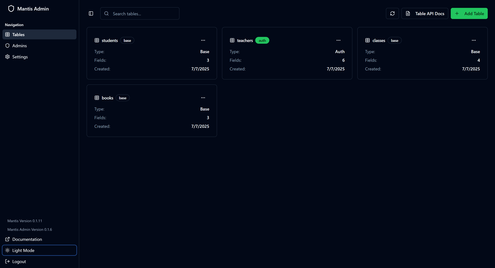

@mainpage Getting Started

<p align="center">
  
</p>

<h1 align="center">Mantis</h1>

<p align="center">
  <strong>A lightweight, pluggable Backend-as-a-Service (BaaS) library built in C++</strong><br />
  Portable. Embeddable. Syncable. Built for speed and extensibility.
</p>


## 🔧 Overview

**Mantis** is a modular, lightweight C++ library designed to power modern backend systems in embedded devices, desktop tools, or standalone server deployments. Inspired by systems like PocketBase and Supabase, Mantis focuses on:

- Minimal runtime footprint
- SQLite as the default local database (with optional MySQL/PSQL support)
- Built-in authentication and access control
- Auto-generated REST APIs
- Pluggable sync layer (client-server)
- Embeddable as a reusable C++ library

---

## 🛠️ Tech Stack

- **Language**: C++
- **Database**: SQLite (default), MySQL/PSQL (planned)
- **Build System**: CMake
- **Packaging**: Docker + CLI
- **Sync**: WebSocket / REST delta sync (planned)

> NOTE: On windows, we use `mingw` not `MSVC` due to some feature incompatibility. For `mingw`, it requires at least `v13` with support for `std::format`.

---

## 🚀 Getting Started

```bash
git clone --recurse-submodules https://github.com/allankoechke/mantis.git
cd mantis
cmake -B build
cmake --build build
./build/mantisapp serve
```
By default, the http server is served on port `7070`.

You can also embed Mantis as a library in your own C++ project:

```cpp
#include <mantis/app/app.h>

int main(const int argc, char* argv[])
{
    mantis::MantisApp app(argc, argv);
    app.init();
    return app.run();
}
```
Check [mantis/examples](https://github.com/allankoechke/mantis/tree/master/examples) for a sample

### Admin Dashboard
Mantis ships with a lightweight admin dashboard available on `<host>:<ip>/admin` and restricted to admin login only. By default, in your setup, you need to create a admin user account using the [CLI](01.cmd.md) command:

```shell
mantisapp admins --add john@doe.com
```

With the admin account created, we can then use it to log in to the admin dashboard. The dashboard allows for easy management of:
- **__CRUD__** on admin accounts
- **__CRUD__** on system logs [WIP?]
- **__CRUD__** on database tables (only the tables managed by mantis).
- **__CRUD__** on records in the tables.
- Schema & database migration [WIP?]

By default, admin auth tokens expire after an hour, but it's configurable in the settings tab of the dashboard.


___admin dashboard snapshot___

---

## 📁 Project Structure

```
mantis/
├── include/
│   └── mantis/         # Public API headers
├── src/                # Internal implementation
├── examples/           # Embedding examples
├── tests/              # Unit & integration tests
├── docker/             # Docker deployment
└── CMakeLists.txt
```

---

## 🤝 Contributing

Contributions are welcome! Please see [CONTRIBUTING.md](https://github.com/allankoechke/mantis/blob/master/CONTRIBUTING.md) and open an issue or PR.

